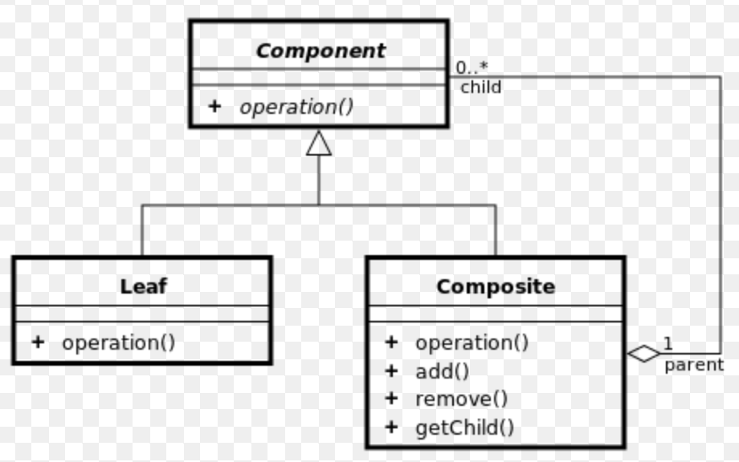

## **컴포지트 패턴(Composite Pattern)**
객체를 트리구조로 구성해서 부분-전체 계층 구조를 구현

### 컴포지트 패턴을 사용하면?
- 클라이언트에서 개별 객체와 복합 객체를 똑같은 방법으로 다룰 수 있다.

### 컴포지트 패턴의 구성 요소
- 컴포넌트(Component) : 리프와 컴포지트를 동일하게 다룰 수 있게 해주는 인터페이스
- 리프(Leaf) : 자식이 없는 클래스
- 컴포지트(Composite) : 자식이 있는 클래스

### 예제
```java
interface Graphic {
    public void print();
}

class Ellipse implements Graphic {

    public void print() {
        System.out.println("Ellipse");
    }
}

class CompositeGraphic implements Graphic {
    private List<Graphic> childGraphics = new ArrayList<Graphic>();

    public void print() {
        for (Graphic graphic : childGraphics) {
            graphic.print();  //Delegation
        }
    }

    public void add(Graphic graphic) {
        childGraphics.add(graphic);
    }

    public void remove(Graphic graphic) {
        childGraphics.remove(graphic);
    }
}
```
```java
public class Program {
    public static void main(String[] args) {
        Ellipse ellipse1 = new Ellipse();
        Ellipse ellipse2 = new Ellipse();
        Ellipse ellipse3 = new Ellipse();
        Ellipse ellipse4 = new Ellipse();

        CompositeGraphic graphic1 = new CompositeGraphic();
        CompositeGraphic graphic2 = new CompositeGraphic();

        graphic1.add(ellipse1);
        graphic1.add(ellipse2);
        graphic1.add(ellipse3);

        graphic2.add(ellipse4);

        graphic1.add(graphic2);

        graphic1.print();
    }
}
```