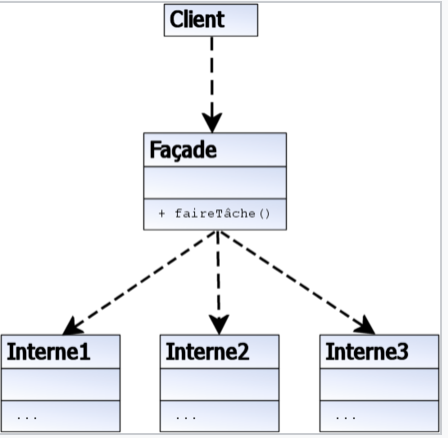

## **퍼사드 패턴(Facade Pattern)**
복잡한 서브 클래스들의 공통적인 기능을 정의하는 상위 수준의 인터페이스를 제공하는 패턴

### 퍼사드 패턴을 사용하면?
- 고수준의 인터페이스로 서브 시스템을 편리하게 이용할 수 있다.

### 어댑터 패턴의 구성 요소
- 퍼사드(Facade) : 고수준의 인터페이스
- 서브아이템(SubItem) : 저수준의 인터페이스 <br/><br/>


### 예제 1 (책 - Headfirst Design Pattern 참조)
영화본다는 상황을 가정
01. 팝콘 기계를 켠다.
02. 팝콘을 튀기기 시작한다.
03. 조명을 어둡게 조절한다.
04. 스크린을 내린다.
05. 프로젝터를 켠다.
06. 프로젝터 입력을 스트리밍 플레이어로 설정한다.
07. 프로젝터를 와이드 스크린 모드로 전환한다.
08. 앰프를 켠다.
09. 앰프 입력을 스트리밍 플레이어로 설정한다.
10. 앰프를 서라운드 음향 모드로 전환한다.
11. 앰프 볼륨을 중간(5)으로 설정한다.
12. 스트리밍 플레이어를 켠다.
13. 영화를 재생한다.

```java
popper.on();                // 01. 팝콘 기계를 켠다.
popper.pop();               // 02. 팝콘을 튀기기 시작한다.

lights.dim(10);             // 03. 조명을 어둡게 조절한다.

screen.down();              // 04. 스크린을 내린다.

projector.on();             // 05. 프로젝터를 켠다.
projector.setInput(player); // 06. 프로젝터 입력을 스트리밍 플레이어로 설정한다.
projector.wideScreenMode(); // 07. 프로젝터를 와이드 스크린 모드로 전환한다.

amp.on();                   // 08. 앰프를 켠다.
amp.setDvd(player);         // 09. 앰프 입력을 스트리밍 플레이어로 설정한다.
amp.setSurrondSound();      // 10. 앰프를 서라운드 음향 모드로 전환한다.
amp.setVolume(5);           // 11. 앰프 볼륨을 중간(5)으로 설정한다.

player.on();                // 12. 스트리밍 플레이어를 켠다.
player.play(movie);         // 13. 영화를 재생한다.
```

### 문제 상황
- 영화가 끝나면 어떻게 꺼야 한다면? -> 방금 했던 일을 전부 역순으로 처리 해야한다.
- 시스템을 업그레이드하면 작동 방법을 또 배워야 한다.

### 예제 2
```java
public class HomeTheaterFacade {
    Amplifier amp;
    Tuner tuner;
    StreamingPlayer player;
    Projector projector;
    TheaterLights lights;
    Screen screen;
    PopcornPopper popper;

    public HomeTheaterFacade (    
        Amplifier amp,
        Tuner tuner,
        StreamingPlayer player,
        Projector projector,
        TheaterLights lights,
        Screen screen,
        PopcornPopper popper
    )

    public void watchMovie(String movie) {
        popper.on();                
        popper.pop();               
        lights.dim(10);
        screen.down();       
        projector.on();             
        projector.setInput(player);
        projector.wideScreenMode(); 
        amp.on();                   
        amp.setDvd(player);
        amp.setSurrondSound();      
        amp.setVolume(5);
        player.on();                
        player.play(movie);
    }

    public void endMovie() {
        popper.off();
        lights.on();
        screen.up();
        projector.off();
        amp.off();
        player.stop();
        player.off();
    }
}
```